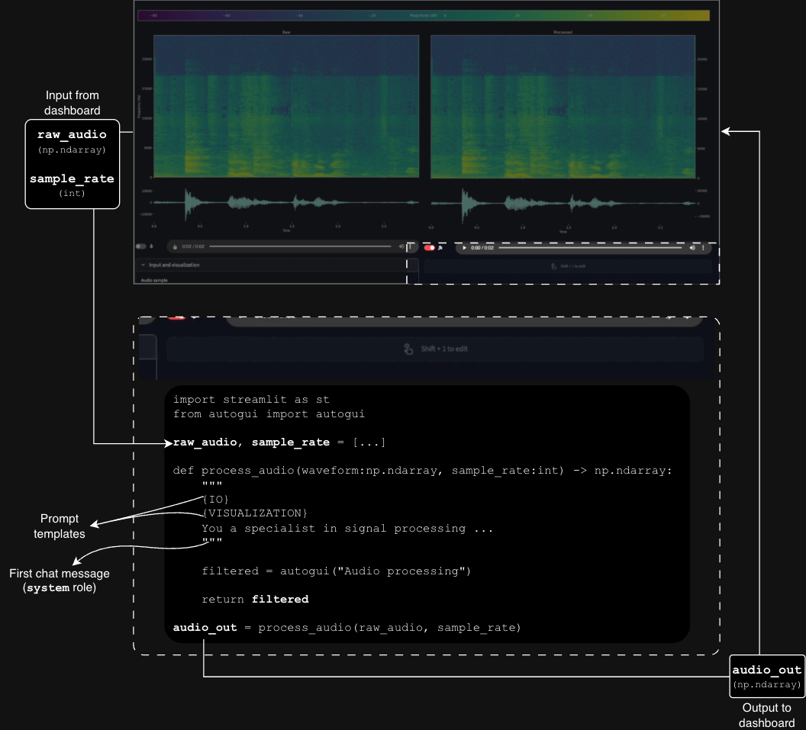

# streamlit-autogui

Vibe code inside a streamlit application and prompt for technical implementations coupled with GUI components on the fly. Give tweaks on top of the generated code if needed.

## Setup

### Installation and requirements

Run the following command to install the [`streamlit-autogui`](https://pypi.org/project/streamlit-autogui/) package:

```bash
pip install streamlit-autogui
```

**Important**: prior to usage, make sure to have:

- some vendor **package** installed,
- the respective **environment variables** needed set (refer to the [expected variable names](https://github.com/moretticb/streamlit-autogui/blob/main/autogui/providers.json) for each vendor), and
- a **deployed model** identified by a name.

Then AutoGUI will be able to locate and make use of models to generate code.

### Usage

AutoGUI works as a placeholder for the (re)implementation of some particular feature. When data coming in and desirable output are known, but the throughput is variable (where experimenting comes in), that is when AutoGUI takes place, as illustrated below.

  


Under the hood, the function *docstring* is used as the first AI chat message (`system` role). In order to simplify prompting and avoid repetitive work, some templates for frequently used features are implemented, such as [IO](https://github.com/moretticb/streamlit-autogui/blob/main/autogui/aicodegen.py#L18-L42) and [visualization](https://github.com/moretticb/streamlit-autogui/blob/main/autogui/aicodegen.py#L44-L55).

Example:

```python
import streamlit as st
import autogui as ag

n = st.number_input("Input number")

# ... some number n comes from some heuristic process, needs some processing, and then outputs a boolean

def is_odd(num:int) -> bool:
	"""{IO}. Submit number `num` to arith operations."""
	
	odd = ag.autogui(
		name="Is odd",
		init_prompt="Show input number, raise to a power, add, check whether result is even or odd"
	)

	return odd

result = is_odd(n)
if result != None:
    st.write("The result is an","odd" if result else "even", "number")

```

### Documentation


<table>
<tr>
<td colspan="2">
Function signature: <code>autogui.autogui(name, init_prompt=None, provider=None, model=None, patience=3, rerun=True, history=COMPACT, features=None, key=None, icon=":material/touch_app:")</code>
</td>
</tr>

<tr>
	<td><code>name</code> (<code>str</code>)</td>
	<td>the name of the AutoGUI widget.</td>
</tr>
<tr>
	<td><code>init_prompt</code> (<code>str</code>)</td>
	<td>the initial prompt to be defined programmatically. If set, <code>init_prompt</code> will be run as the app is rendered. If <code>None</code>, the initial prompt must be inserted via user interface. Defaults to </code>None</code>.</td>
</tr>
<tr>
	<td><code>provider</code> (<code>str</code>)</td>
	<td>the provider of the AI model to be used. If <code>None</code>, AutoGUI will attempt to [fetch](https://github.com/moretticb/streamlit-autogui/blob/main/autogui/providers.json) the first provider of which the due packages and variables are set. Defaults to <code>None</code>.</td>
</tr>
<tr>
	<td><code>model</code> (<code>str</code>)</td>
	<td>the deployment name of the model (from <code>provider</code>) to be used. Code is less error prone when this is set. Defaults to <code>None</code>.</td>
</tr>
<tr>
	<td><code>patience</code> (<code>int</code>)</td>
	<td>the number of attempts to correct the generated code if it comes broken before raising errors. Defaults to <code>3</code>.</td>
</tr>
<tr>
	<td><code>rerun</code> (<code>bool</code>)</td>
	<td>Whether to refresh upon any UI change, Streamlit style. If <code>False</code>, an extra button will be rendered to trigger the generated code, which gets encapsulated in a [fragment](https://docs.streamlit.io/develop/api-reference/execution-flow/st.fragment). Defaults to <code>True</code>.</td>
</tr>
<tr>
	<td><code>history</code> (<code>int</code>)</td>
	<td>
		the level of verbosity on how to handle the internal chat history. Takes the following flags:
		<ul>
			<li><code>autogui.STATIC</code>: No context/history is kept. Ideal for single calls and simplistic follow-up.</li>
			<li><code>autogui.FULL</code>: Keeps full chat history. This can become expensive (time and cost wise) as history grows, since every new version of the code is kept.</li>
			<li><code>autogui.COMPACT</code>: Keeps only messages with <code>system</code> and <code>user</code> roles, plus the very last message from <code>assistant</code> (i.e., the generated code) for context. Ideal for following up, as previous fixes are taken into account for next iterations.</li>
		Defaults to flag <code>autogui.COMPACT</code>.
	</td>
</tr>
<tr>
	<td><code>key</code> (<code>str</code>)</td>
	<td>the (optional) Streamlit <code>key</code> parameter. If not set, a key will be generated based on <code>name</code>. Must be set only when two AutoGUI widgets have the same <code>name</code>.</td>
</tr>
<tr>
	<td><code>icon</code> (<code>str</code>)</td>
	<td>the (optional) icon to be displayed in the widget button. If set, must be one of the Material Symbols library (rounded style) in the format <code>":material/icon_name:"</code>, where <code>"icon_name"</code> is the name of the icon in snake case. Defaults to <code>":material/touch_app:"</code>.</td>
</tr>
<tr>
	<td colspan="2">Returns a <code>list[Any]</code> or <code>Any</code>, depending on the schema defined by the user.</td>
</tr>
</table>


